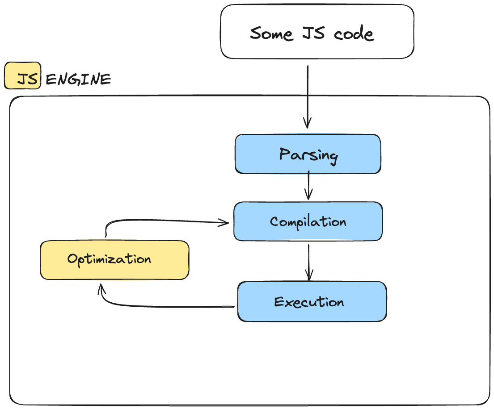
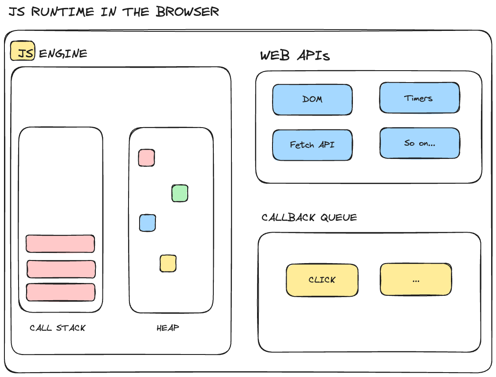
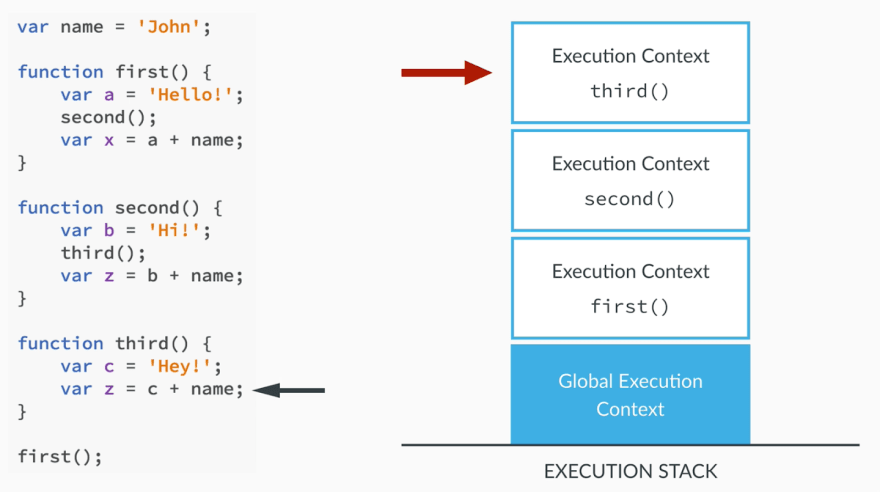
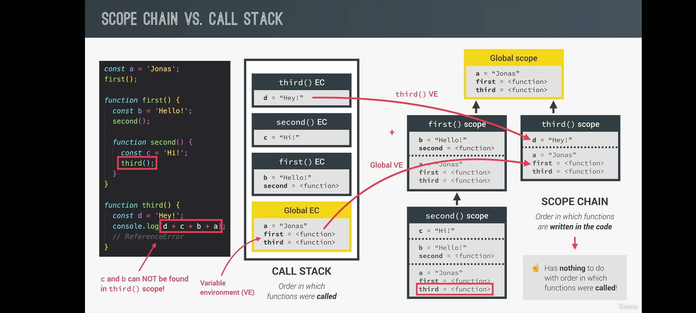
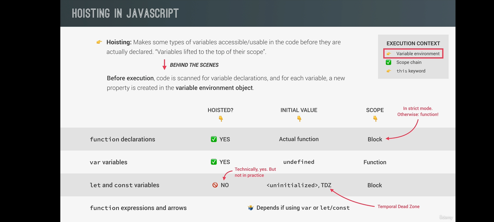
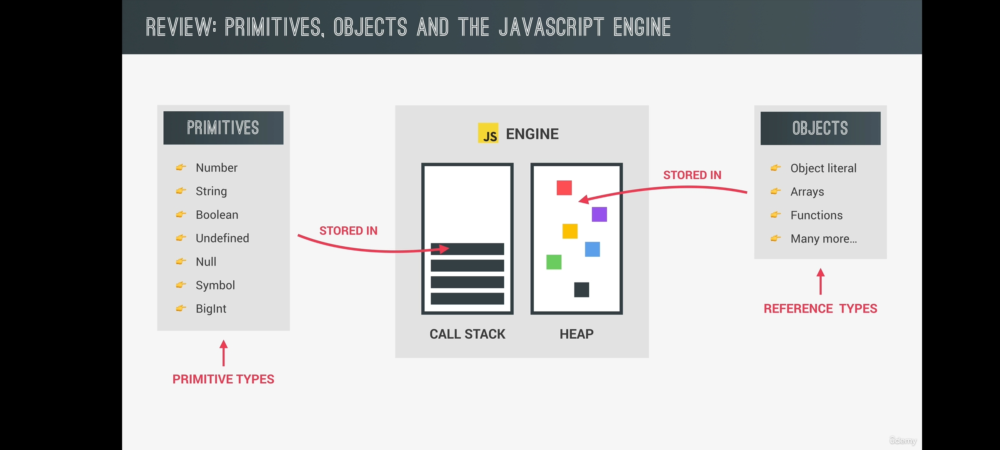
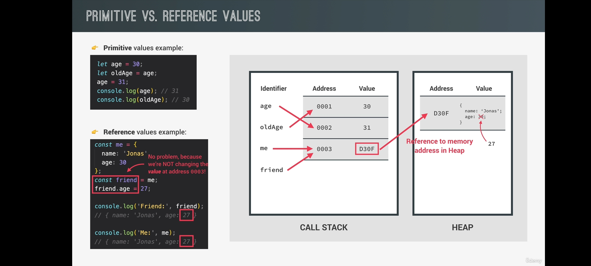

## What is JavaScript
- JavaScript is a `High-Level` , `Prototyped-Based` , `Object-Oriented` , `Multi-Paradigm`, `Interpreted` or Just-In-Time Compiled, `Dynamic`, `Single-Threaded` , `Garbage-Collected Programming Language` with First-Class Functions and a Non-Blocking Event Loop Concurrency Model.
    
    **High-Level** : A high-level language is a programming language that is designed to be easier for humans to read and write. These languages are closer to human language and further from the machine language that computers understand directly. 

    **Prototyped-Based** : In prototype-based programming, objects can inherit directly from other objects through a mechanism typically known as "prototypal inheritance." Each object serves as a prototype for the new object, and the new object can inherit attributes and behavior (methods) from its prototype. 

    **Multi-Paradigm** : A multi-paradigm programming language is a language that supports more than one programming paradigm. A programming paradigm is a style or approach to programming, which dictates the structure, design, and organization of code.Some Example of Programming paradigm is `Procedural Programming` , `Object-Oriented-Programming` and `Functional-Programming`

    **Interpreted-Language** : An interpreted language is a type of programming language for which most of its implementations execute instructions directly, without the need for a compilation step. In an interpreted language, the source code is read and executed line by line or statement by statement by an interpreter program. This is in contrast to a compiled language, where the source code is translated into machine code before being executed.JavaScript is build as an intepreted language but most of the modern browser's JS Engine can be both interpreted and compilated . This is why JS is called JIT compilation . In JIT compilation entire code is converted into machine code at once , then executed immediately.

    **Dynamic** : A dynamic language is a type of programming language where most of the behavior of a program is determined at runtime.In a dynamic language, variables can change their type or value during the execution of the program, and new code can be generated and executed while the program is running.In Dynamically typed language we are not required to give data type of variables .

    **Single-Threaded** : Single-threaded refers to the execution model in which a program or process can only perform one task at a time. In a single-threaded application, instructions are executed sequentially, one after the other. This means that if one task is being executed, other tasks have to wait until the current task is completed before they can be executed.

    **Garbage-Collected-PL** : A garbage-collected programming language is a language where the runtime system automatically manages memory allocation and deallocation for the programmer. In these languages, the programmer does not need to explicitly allocate memory for objects or free memory when objects are no longer needed. Instead, the garbage collector automatically identifies and reclaims memory that is no longer in use.
    Garbage collection helps simplify memory management and reduce the risk of memory leaks and other memory-related bugs. It allows programmers to focus more on writing correct and efficient code without having to worry about manual memory management.

    **First-Class-Function** : In a language with first-class functions, fucntions are simply treated as variables. We can pass then into other functions, and return them from functions.

## Working of JavaScript(JS Engine and JS Runtime Environment)
- When you write JavaScript code and run it in a browser, the code doesn't directly interact with your computer's hardware. Instead, it interacts with the JavaScript engine, which acts as an intermediary between your code and the underlying machine.Every browser has its own JS engine, but the most well known one is Google's v8 Engine. 

    **JS-Engine** : A JavaScript engine is simply a computer program that executes JavaScript code. It's responsible for translating human-readable JavaScript code into machine-readable instructions that the computer's hardware can execute.a JavaScript engine is a program designed to execute JavaScript code. It utilizes the call stack and execution context, with all necessary data stored in the heap.

    
    

    **JS-Runtime**  : A JavaScript (JS) runtime is a comprehensive environment that enables the execution of JavaScript code. It consists of various components working together to facilitate the execution of JavaScript applications.When examining the JavaScript runtime in a browser, it consists of the JS Engine, WEB APIs, callback queue, and an event loop. The event loop plays a crucial role in transferring callback functions from the queue to the call stack, ensuring the seamless execution of JavaScript applications.
    

## Explain the Execution context and call stack 
- javaScript execution context is a crucial part of understanding how JavaScript works behind the scenes. It determines the environment in which code is executed and what variables and functions are available to use. The creation phase includes creating the global and function execution contexts, creating the scope chain, and allocating memories for the variables and functions. During the execution phase, the JavaScript engine executes the code line by line. This includes evaluating and executing statements.

    **Execution-Context** : When the JavaScript engine scans a script file, it makes an environment called the Execution Context that handles the entire transformation and execution of the code. 
    During the context runtime, the parser parses the source code and allocates memory for the variables and functions. The source code is generated and gets executed.
    `There are two types of execution contexts: global and function`. The global execution context is created when a JavaScript script first starts to run, and it represents the global scope in JavaScript. A function execution context is created whenever a function is called, representing the function's local scope.

    **Call-Stack** : To keep the track of all the contexts, including global and functional, the JavaScript engine uses a call stack. A call stack is also known as an 'Execution Context Stack', 'Runtime Stack', or 'Machine Stack'.
    It uses the LIFO principle (Last-In-First-Out). When the engine first starts executing the script, it creates a global context and pushes it on the stack. Whenever a function is invoked, similarly, the JS engine creates a function stack context for the function and pushes it to the top of the call stack and starts executing it.
    
    

## Explain Scope in JavaScript

- **Scope** : Space or Environment in which a certain variable is declared. There is global scope, function scope, and block scope.

- **Scope-of-a-variable** : Region of our code where a certain variable can be assessed

>[!Note]
>Var is function scoped and let and const are block scoped

## Explain Hoisting and Temporal Dead Zone(TDZ)

- **Hoisting** : Hoisting is a concept or behavior in JavaScript where the declaration of a function,    variable, or class goes to the top of the scope they were defined in.
    
    

  **Temporal Dead Zone(TDZ)** : The TDZ of a variable declared in your JavaScript code is the area where the variable is hoisted but inaccessible until it is initialized with a value. This concept applies to variables declared with let and const (but not var).

## How and where Primitives and Objects were stored in JS
- Primitives like `Number` , `String` , `Boolean` , `Undefined` , `Null` , `Symbol` , `Bigint` were stored in Call Stack
- Objects like `Object literal` , `Arrays` , `Functions` etc were stored in Heap

- Primitives with const cann't be changed , but object with const can be changed but internally it is not we are just changing values not the reference 

