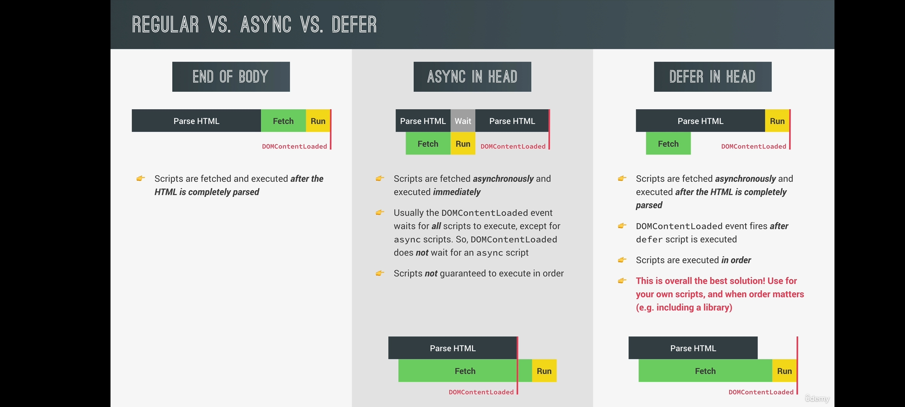

## What is DOM ?
- DOM stands for Document Object Model. It's the interface between JavaScript and the web browser. With the help of the DOM, you can write JavaScript to create, modify, and delete HTML elements, set styles, classes and attributes, and listen and respond to events.

## How DOM works ?
- The DOM is organized in a really clever manner. The parent element is called the EventTarget. 
- The EventTarget interface is implemented by objects which can receive events and may have listeners for them. In other words, any target of events implements the three methods associated with this interface. Element, and its children, as well as Document and Window are the most common event targets, but other objects can be event targets, too.

## What is Node ?
- In the DOM, all parts of the document, such as elements, attributes, text, and so on are organized in a hierarchical tree-like structure that consists of parents and children. These individual parts of the document are known as nodes.
- The Node in the above diagram is represented by a JavaScript object. 

## Some Common Functionality
- Smooth Scrolling
    - Method to remember for this effect
        - element.getBoundingClientRect() : This method give coordinates of the element with respect to the current viewport
        - window.pageXOffset and window.pageYOffset : These methods give X and Y coordinates of current scroll position form the top of the page
        - window.scrollTo() : Takes x and y coordinates or a dictionay of left , top and behaviour as arguments

    - One liner for this effect
        - [position where you wants to scroll to].scrollIntoView({behaviour :'smooth'});

- Lazy Image Loading and Sticky Navbar
    - Intersection Observer API : have two arguments , a callback functions and options 
    - callback is called when the observer intersect the root
    - options is an object of three things *root*(element which you wants to intersect , if null then it will track viewport) , *threshold*(percentage of intersection) and *rootMargin*
    - `syntax` : observer.observe('Element') , where observer = new IntersectionObserver(callback , options);

## Explain Event Propagation .

- *Event Propagation* determines in which order the elements receive the event(s). There are two ways to handle this event propagation order in the DOM: *Event Bubbling* and *Event Capturing*.
- *Event Bubbling* : When an event happens on a component, it first runs the event handler on it, then on its parent component, then all the way up on the other ancestors’ components. By default, all event handlers move through this order from center component event to outermost component event.
- *Event Capturing* : This is the opposite of bubbling. The event handler acts first on its parent component and then on the component where it was actually meant to fire. In short, this means that the event is first captured by the outermost element and propagated to the inner elements. It is also called trickle down.

## What is Event Delegation?
- *Event delegation* is a technique in JavaScript where we delegate(`to give a particular job to someone else so that they do it for you`) the responsibility of handling an event to a parent element. By doing so, we avoid attaching multiple event listeners to individual elements, especially when dealing with a large number of similar elements, such as a list or a table.

## What does DOM Traversing means?
- To traverse the DOM means to move between the different elements/nodes within the HTML document. This may includes selecting or accessing parent, child, or sibling elements (or nodes). You do this to get information or manipulate the document structure.
- Selecting a Parent with *parentNode* or *parentElement*
- Selecting Elements with *childNodes* or *children*
- You can also select sibllings of the nodes using *nextSibling*, *nextElementSibling* ,*previousSibling* ,*previousElementSibling*

## What is difference between Node and Element ?
- Nodes are the building blocks of the DOM. They represents different components in the HTML structure. Whereas An element is a specific type of node that defines the structure of the document's content. 
- Elements are a specific type of node, but not all nodes are elements. Other types of content like attributes of elements, text content, and comments within the code are nodes too. But they are not elements.

## Script Loading : *Regular* Vs *Async* Vs *Defer*
- 

