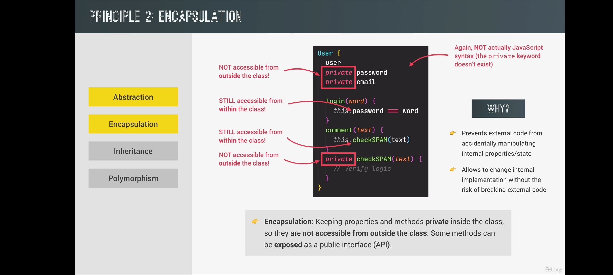
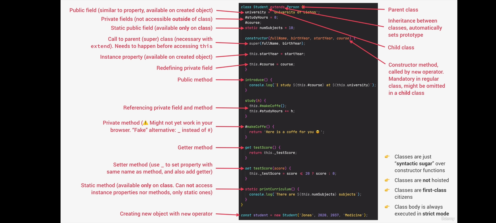

## What is Oops ?
- Object-oriented programming (OOP) is a computer programming model that organizes software design around data, or objects, rather than functions and logic. An object can be defined as a data field that has unique attributes and behavior.

# Explain Class and Object in Oops.
- *Object* : An Object is a unique entity that contains properties and methods. For example “a car” is a real-life Object, which has some characteristics like color, type, model, and horsepower and performs certain actions like driving. The characteristics of an Object are called Properties in Object-Oriented Programming and the actions are called methods. An Object is an instance of a class. 

- *Class* : Classes are blueprints of an Object. A class can have many Objects because the class is a template while Objects are instances of the class or the concrete implementation. 
- 

# What are four fundamental principles of Oops
- The 4 fundamental principles of Oops are:
    - Abstraction 
    - Encapsulation  
    - Inheritance  
    - Polymorphism   

## What is Constructor Function?
- It is a technique to create object form a function(this is how we create object without class);
- This is how built-in Object like Arrays, Maps or Sets are actually implemented.
- Constructor function does not work with Arrow function because , arrow function does not have this keyword and to implement Constructor function we need this keyword. This function is always called with new keyword
- New keyword does 4 things
    - New {} (object) is created
    - function is called and this is set to this object ( this = {})
    - (object){} is linked to prototype
    - function automatically return newly created object {}

*Summary of all ES6 Classes and some of it's properties*
